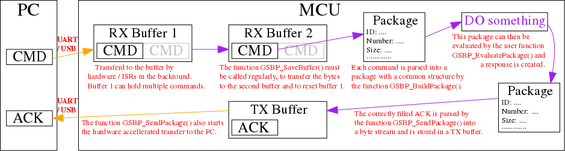

# MCU Implementation of the GeneralSerialByteProtocol (GSBP)

This describes the microcontroller API and some design decisions for the GSBP implementation used on the STM32 microcontroller family.  
Please also have a look at the __examples__ int the examples folder.

## Functions of the GSBP Module

The GSBP module is not just a parser for the GSPB protocol, but provides:

* functions to receive a byte stream from UART or USB interfaces, hardware accelerated,
* functions to read the byte stream and parse the information into a general structure, __a GSBP package__ struct,
* functions and concepts to work with these packages, e.g. to extract some information or setup parameter,
* functions to send ACK packages to the PC, by building the GSBP byte stream and then use UART or USB,
* helper functions to send messages, errors and simple ACKs to the PC, and
* debugging functions, for sending messages to a dedicated debug UART.

The module also supports multiple interfaces, so two or more UART or UART and USB can be active at the same time.


## General simplified Workflow

This section describes the Workflow and the different steps, a message from the PC has to go through and how the ACK is send back.



This is achieved with the periodic call of the function `GSBP_CheckAndEvaluatePackages()`, which in there calls `GSBP_SafeBuffer()`, `GSBP_BuildPackage()`, and `GSBP_EvaluatePackage()`.   
The first three functions are general API functions and only the last function, `GSBP_EvaluatePackage()`, is project specific.

The module is therefor separated in to two parts,

* __`GSPB_Basic.h/c`__ ---> which contains the general API functions, and
* __`GSPB_Basic_Config.h/c`__ ---> which contains the project specific configuration, definitions, and functions.


## GSBP Header File `GSPB_Basic_Config.h`

This file contains the project specific configuration, like:

* UART or USB connection
* number of interfaces
* max payload size of the packages
* type if hardware acceleration (none, ISRs, DMA)
* level of debug support
* command and ack ID's
* error codes
* payload structure for each command / ack

The file should therefore be copied for each MCU project.

## GSBP Source File `GSPB_Basic_Config.c`

This file contains the implementation of the three project specific functions:

* `GSBP_Init()` --> Setup function where all the used interfaces are connected with GSBP handles, an abstraction layer to support multiple interfaces.
* `GSBP_EvaluatePackage()` --> Project specific function where the actions for the different commands are implemented.
* `GSBP_GetMcuState()` --> Simple function returning the current state of a assumed MCU state machine, used in the `GetStateACK`.
* `GSBP_SendNodeInfo()` --> Project specific implementation of the predefined command `GetNodeInfo`.
* `GSBP_SendStatus()` --> Project specific implementation of the predefined command `GetStatus`.


## GSBP Header File `GSPB_Basic.h`

This file contains some general definitions, the definition of the struct's __GSBP Handle__, __gCOM__, and __GSBP Package__, as well as the definitions of the API functions.
Bold functions are functions most often used.

This file can be linked and shared between projects, because there is no project specific code inside. 
Sharing the file ensures bug fixes and enhancements are available to all projects....

### API Functions for Managing GSBP Handles

* `void GSBP_InitHandle(GSBP_Handle_t *Handle, UART_HandleTypeDef *huart)`
* `void 	GSBP_DeInitHandle(GSBP_Handle_t *Handle)`
* `bool	GSBP_SetDefaultHandle(GSBP_Handle_t *Handle)`

### API Functions for Receiving Packages

* `void GSBP_ClearBuffer(GSBP_Handle_t *Handle)`
* `uint8_t GSBP_SaveBuffer(GSBP_Handle_t *Handle)`
* `bool GSBP_BuildPackage(GSBP_Handle_t *Handle, gsbp_PackageRX_t *Package)`
* `bool 	GSBP_BuildPackageAll(GSBP_Handle_t *Handle, gsbp_PackageRX_t *Package, bool CopyData)`
* `bool GSBP_CheckForPackagesAndEvaluateThem(GSBP_Handle_t *Handle, uint8_t *PackagesEvaluedCounterToIncrease)`
* `uint8_t GSBP_CheckAndEvaluatePackages(void)`

### API Functions for Receiving Packages

* __`bool GSBP_SendPackage(GSBP_Handle_t *Handle, gsbp_PackageTX_t *Package)`__ --> Sends a GSBP package to the PC using the supplied Handle/interface.
* `bool GSBP_SendPackageAll(GSBP_Handle_t *Handle, gsbp_PackageTX_t *Package, bool CopyData)`
* __`void 	GSBP_SendUniversalACK(GSBP_Handle_t *Handle, uint16_t ResponceToCMD, bool Success)`__ --> Sends a predefined ACK to the PC. Useful if the ACK has no payload.
* `void 	GSBP_SendUniversalACKext(GSBP_Handle_t *Handle, uint16_t ResponceToCMD, uint8_t PackageNumber, bool Success)`
* __`void 	GSBP_SendMSG(GSBP_Handle_t *Handle, gsbp_MsgTypes_t Type, uint8_t State, uint16_t ErrorCode, const char* Message, ...)`__ --> Sends a message to the PC. The folling types are defined: `MsgCriticalError, MsgError, MsgWarning, MsgInfo, MsgDebug`.
* `void 	GSBP_SendNodeInfo(GSBP_Handle_t *Handle, uint8_t packageNumber)` --> dummy function, is overwritten by project specific implementation
* `void GSBP_SendStatus(GSBP_Handle_t *Handle, uint8_t packageNumber)` --> dummy function, is overwritten by project specific implementation

### API Functions for Debugging

* `void gsbpDebugMSG(uint8_t level, const char* message, ...)` -> see section _Debugging with GSBP -> gsbpDebugMSG()_

### Variables

This header file also defines the global variable `gCOM` which provides access to all the GSBP related information .

## Using the GSBP Module in Own Projects

Please also look at the examples and there readme.md files:

* `examples/GSBP_DevDumy__MCU_L432_UART` --> [STM32CubeIDE project for the Nucleo-L432KC board using the build in UART - ST-Link bridge](../examples/GSBP_DevDumy__MCU_L432_UART/readme.md)
* `examples/GSBP_DevDumy__MCU_L432_USB` --> [STM32CubeIDE project for the Nucleo-L432KC board using the USB interface of the MCU](../examples/GSBP_DevDumy__MCU_L432_USB/readme.md)


### Setup

Fist , you need to copy the GSBP module files `GSBP_Basic_Config.h/c__` from the `MCU_code` folder into your MCU project folder structure and rename the files to valid C files -> `GSBP_Basic_Config.h/c`.  
The GSBP module files `GSBP_Basic.h/c` from the `MCU_code` folder, can be link or copied to your MCU project, what ever you prefer.  
If you used a new folder, link the examples do, make sure the header files and source code files are known to the IDE by adjusting the project configuration. You can add the new `App/` directory by going into the project settings and:

* under _C/C++ Build_ > _Settings_ > _Tool Settings_ > _MCU XXX Compiler_ > _Include paths_ add the "`../App`" string,
* under _C/C++ General_ > _Paths and Symbols_ > _Source Location_ add the `App` folder (`Add Folder ...`).

You then need to configure the GSBP in your MCU project according to your needs.  
If you are using the UART interface, detailed instructions about how to configure the STM MCU using CubeMX / CubeIDE can be found in [readme_setup_STM_UART.md](./readme_setup_STM_UART.md).    
Similar instructions for the STM MCU USB configuration can be found in [readme_setup_STM_USB.md](./readme_setup_STM_USB.md).

   
After the hardware setup, the file `GSBP_Basic_Config.h` must be adjusted for your project specific needs, like UART / USB interface, command IDs, payload definitions and so on.  
Then, as last step, the file `GSBP_Basic_Config.c`, specifically the functions `GSBP_Init()` and `GSBP_EvaluatePackage()`,  need to be adjusted to your project specific needs.

Editing the provided example `GSBP_Init()` function is normally only needed if you have more than one interface and to adjust the `default_interface`.
Editing the provided example `GSBP_EvaluatePackage()` function is needed, to add your project specific command IDs and call your functions for initialisation, application start and so on.

Your project should now compile, because there should be no unknown defines, functions or variables left.  
However, the GSBP module will not yet work, because you need to include the module into your `main.c/cpp`.

This is done by including the the GSBP header files into the `main.c/cpp` file like:
```C
/* USER CODE BEGIN Includes */
#include "GSBP_Basic_Config.h"
#include "GSBP_Basic.h"
/* USER CODE END Includes */
```

The `GSBP_Init()` function must the be called at the start of the main function, e.g. in the `USER CODE BEGIN 2` section, like: 
```C
/* USER CODE BEGIN 2 */

    // Initialise the communication system
  	GSBP_Init();
```
### Receiving Data

The process of receiving data was already started be calling `GSBP_Init()` (data is saved in RX Buffer 1). 
To act on the received data/commands, the functions `GSBP_SafeBuffer()`, `GSBP_BuildPackage()`, and `GSBP_EvaluatePackage()` must be called periodically for the specific GSBP handle(s) used in your project.  
This can be easily done by adding the following code to the main loop, e.g. in section `USER CODE BEGIN WHILE`:
```C
/* USER CODE BEGIN WHILE */
  while (1)
  {
		/*
		 *  run the GSBP callback to check for new packages
		 */
		if (HAL_GetTick() >= gCOM.NextCallbackTimer) {
			gCOM.NextCallbackTimer = HAL_GetTick() +GSBP_SETUP__CALLBACK_PERIOD_IN_MS;
			GSBP_CheckAndEvaluatePackages();
		}
```

This will run every X milliseconds and check if new commands are available and if so, call your `GSBP_EvaluatePackage()` function on the found GSBP package.

### Accessing the GSBP Package Payload data

The predefined GSBP function `GSBP_CheckAndEvaluatePackages()` uses the predefined GSBP package `CMD` in the global GSBP variable `gCOM` to store the latest received command.  
The payload of this command, if any, is stored in the `Data` field of the C GSBP package struct, which is a simple `uint8_t` array.
The size of this payload is stored in the struct field `DataSize`.

The data is usually in the __little-endian__ format!  
The command payload can therefor be extracted by simple bit shifting, like:
```C
    uint16_t exampleData = gCOM.CMD.Data[0] | gCOM.CMD.Data[0] << 8;
```

Another, much more elegant method is the reassignment of the payload memory to the correct command payload struct, demonstrated in the following example:
```C
// define the struct -> __packed is a shortcut for the GCC `__attribute__((__packed__))`,
// which ensures, that the compiler does not introduce gaps, in order to align the variable at 32bit boundaries
typedef struct __packed {
	uint16_t errorCode;
	uint8_t  state;
	int32_t  someInt;
	float    someFloat;
} gsbp_ACK_status_t;
// create a pointer of the X type and let it point to the begin of the payload data
gsbp_ACK_status_t *ackPayload = (gsbp_ACK_status_t*)gCOM.CMD.Data;

// assign values to the payload variables
ackPayload->errorCode = 0;
ackPayload->state = 1;
ackPayload->someInt = -64000;
ackPayload->someFloat = +3.14;

//reading from the payload variable
float Pi = ackPayload->someFloat;
```

However, this method is vulnerable for memory errors, so you should pay extra attention to your variables life time.

### Sending Data

Sending data uses the same package concept as receiving data. 
However, the GSBP struct type `gsbp_PackageTX_t` (..`TX_t`) has to be used with the `GSBP_SendPackage()` function.
Both package types have the same structure, but can differ in the max. payload size, as defined in `GSBP_SETUP__MAX_PAYLOAD_SIZE_TX`.

A predefined TX package is available in `gCOM.ACK` and can be used in replies to commands.

As a bare minimum, the fields `CommandID` and `DataSize` have to be set. Any other field is optional or is populated by the `GSBP_SendPackage()` function.

For simple ACKs with no ACK payload, the universal ACK can be used. The function void `SendUniversalACK()` builds the corresponding package and sends it.

For errors, warnings, or debug/info messages, the GSBP function `GSBP_SendMSG()` can be used, which builds the 
corresponding package and sends it.

Most of the function get a parameter `RequestID`, which is used on the PC side to match command and response, e.g. if more than one command X is send directly after another.


## Debugging with GSBP -> gsbpDebugMSG()

The API supports software development with dedicate support for debug messages via the API function:  
`void gsbpDebugMSG(uint8_t level, const char* message, ...)`

This function takes any number of arguments, which are passed to `vsnprintf()`, which means that `gsbpDebugMSG()` can be used like `printf()`, however with limited support of floating point numbers (e.g. `%f`).  
However, support might be possible with newlib-nano, see _project setting_ > _C/C++ Build_ > _Settings_ > _ MCU Setting_ > option: _Use float with printf from newlib-nano_ in STM32CubeIDE.
Another workaroud is converting the float in an int16_t like `(int16_t)floatVariable*10`.

Another important aspect of the function is the first parameter `level` which indicates the __debug level__ this message belongs to.
The following levels are defined:  

1. -> for errors
2. -> for warnings
3. -> for status updates
4. -> for debug output level 1
5. -> for informational output
6. -> for debug output level 2
7. -> for debug output level 3

Each level includes any level below, e.g. in debug level 2, also errors will be displayed.

The messages are send via a dedicated _debug UART_, which is configured in `GSBP_Basic_Config.h` .  
If the debug level is 0 or if `GSBP_DEBUG_UART` is not defined, any call to `gsbpDebugMSG()` will be eliminated by the compiler via pre-processor functionality.

The `GSBP_DEBUG_UART` should not be configured as GSPB handle! In fact, there is no need for a full UART, a _transmit only UART_ (only one pin) is sufficient.

## Debugging GSBP itself

Debugging the functionality of the GSBP functionality is also possible via the _debug level_ and `gsbpDebugMSG()`.

If _debug level_ is set to 6, debug messages for each received package and each send package will be displayed, allowing troubleshooting of communication problems.

In addition to the debug messages, GPIO toggles are also embedded into important functions.
These _debug GPIO's_ need to be configured in `GSBP_Basic_Config.h` like `#define gsbpDebugToggle_D1()  HAL_GPIO_TogglePin(D1_GPIO_Port, D1_Pin)`, where `D1` is a GPIO pin, configured as GPIO_Output ind CubeMX and named `D1`. The name of the GPIO pin depends of course on your linking....  
If this feature is not use, just leave these defines empty.

If the _debug level_ is larger or equal than 4, 

* `.._D1()` will be active during execution of the `GSBP_SaveBuffer()` function
* `.._D2()` will be active during execution of the `GSBP_BuildPacakge()` function
* `.._D3()` will be active during execution of the `GSBP_SendPacakge()` function
* `.._D4()` will be active during execution of the `HAL_UART_RxCpltCallback()` ISR

This allows debugging the program flow without interruptions or delays by debug messages.